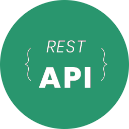
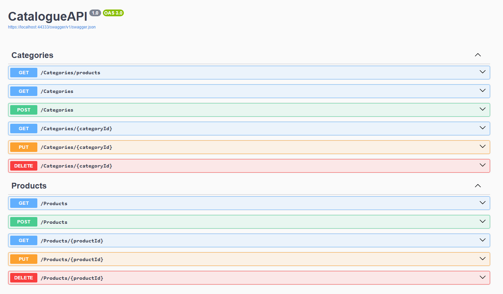

<a id="readme-top"></a>


<br />
<div align="center">
  <a href="https://github.com/roberto-juniorjp/catalogue-api">
    
  </a>

  <h3 align="center">dotNet ASP.NET Rest API</h3>

  <p align="center">
    A Rest API made with dotNet ASP.NET to catalogue a list of products by category.
    <br />
    <a href="https://www.linkedin.com/in/roberto-juniorjp/"><strong>My Linkedin</strong></a>
    <br />
    <br />
    <a href="https://github.com/roberto-juniorjp/catalogue-api.git">Clone URL</a>
    ·
    <a href="https://github.com/roberto-juniorjp">My GitHub</a>
  </p>
</div>


<!-- TABLE OF CONTENTS -->
<details>
  <summary>Table of Contents</summary>
  <ol>
    <li>
      <a href="#about-the-project">About The Project</a>
      <ul>
        <li><a href="#built-with">Built With</a></li>
      </ul>
    </li>
    <li>
      <a href="#getting-started">Getting Started</a>
      <ul>
        <li><a href="#how-to-run">Prerequisites</a></li>
      </ul>
    </li>
    <li><a href="#roadmap">Roadmap</a></li>
    <li><a href="#contact">Contact</a></li>
    <li><a href="#acknowledgments">Acknowledgments</a></li>
  </ol>
</details>


<!-- ABOUT THE PROJECT -->
## About The Project

[](https://github.com/roberto-juniorjp/catalogue-api)

This was my first Rest API. Although it is very basic one, i did my best to not only learn the basics of a Rest API, but also make the code as clean as possible and follow proper gitflow procedures as well as provide a proper documentation for this project.

What you will find on this project:
* A Product catalog with multiple endpoints to provide a proper CRUD experience
* A Category catalog with multiple endpoints to provide a proper CRUD experience integrated with products through a foreign key that exists at the products
* dotNet environment built with ASP.Net framework
* Swagger built in
* The project used MySQL as Database solution. The entire database is generated and populated Code First through the entity framework present in the project

Feel free to take a look and give some feedback!

<p align="right">(<a href="#readme-top">back to top</a>)</p>


### Built With

Heres the frameworks used in the project.

* [![dotNet][dotnet]][dotnet-url]
* [![CSharp][csharp]][csharp-url]
* [![MySQL Server][mysql-server]][mysql-server-url]
* [![MySQL Workbench][mysql-workbench]][mysql-workbench-url]
* [![Swagger][swagger]][swagger-url]
* [![Postman][postman]][postman-url]
* ![CLI][terminal]
* [![Git][git]][git-url]

<p align="right">(<a href="#readme-top">back to top</a>)</p>


<!-- HOW TO RUN -->
## Getting Started

You will need the dotNet environment along with a few tools to make sure the project can run locally.

### How To Run

Below you can find all instructions to replicate my environment.
* **Operating System**
  <br>Windows 11
  
* **Terminal**
  <br>Bash
  
* **Installers**
  <br>[dotNet Downloader](https://dotnet.microsoft.com/pt-br/download)
  <br>[MySQL Server](https://dev.mysql.com/downloads/mysql/)
  <br>[mySQL Workbench](https://dev.mysql.com/downloads/workbench/)

* **Package Installs**
  ```sh
  *Entity Framework*
  dotnet tool install --global dotnet-ef
  ```

<p align="right">(<a href="#readme-top">back to top</a>)</p>


<!-- ROADMAP -->
## Roadmap

- [x] Build a Back-end Rest API with dotNet ASP.NET and Entity Framework
- [ ] Build React Front-end
- [ ] Consume the Back-end Rest API with React Front-end
- [ ] Build Angular Front-end
- [ ] Consume the Back-end Rest API with Angular Front-end

<p align="right">(<a href="#readme-top">back to top</a>)</p>


<!-- CONTACT -->
## Contact

Roberto Júnior - [@roberto-juniorjp](https://www.linkedin.com/in/roberto-juniorjp/)
Email - [juniorjp@gmail.com](mailto:juniorjp@gmail.com)
Whatsapp - [+55 (83) 99922-2312](https://api.whatsapp.com/send?phone=5583999222312)

<p align="right">(<a href="#readme-top">back to top</a>)</p>


<!-- ACKNOWLEDGMENTS -->
## Acknowledgments

* [Img Shields](https://shields.io)
* [Robert Santos](https://github.com/RO-HSA)

<p align="right">(<a href="#readme-top">back to top</a>)</p>


<!-- MARKDOWN LINKS & IMAGES -->
[dotnet]: https://img.shields.io/badge/.NET-512BD4.svg?style=for-the-badge&logo=dotnet&logoColor=white
[dotnet-url]: https://dotnet.microsoft.com/en-us/download
[csharp]: https://img.shields.io/badge/C%23-239120?style=for-the-badge&logo=dotnet&logoColor=white
[csharp-url]: https://learn.microsoft.com/en-us/dotnet/csharp/tour-of-csharp/
[mysql-server]: https://img.shields.io/badge/MySQL%20Server-4479A1?style=for-the-badge&logo=mysql&logoColor=white
[mysql-server-url]: https://dev.mysql.com/downloads/mysql/
[mysql-workbench]: https://img.shields.io/badge/MySQL%20Workbench-4479A1?style=for-the-badge&logo=mysql&logoColor=white
[mysql-workbench-url]: https://dev.mysql.com/downloads/workbench/
[swagger]: https://img.shields.io/badge/Swagger-85EA2D?style=for-the-badge&logo=swagger&logoColor=black
[swagger-url]: https://swagger.io/
[postman]: https://img.shields.io/badge/Postman-%23FF6C37?style=for-the-badge&logo=postman&logoColor=white
[postman-url]: https://www.postman.com/downloads/
[terminal]: https://img.shields.io/badge/Command%20Line-white?style=for-the-badge&logo=gnometerminal&logoColor=black
[git]: https://img.shields.io/badge/Git-%23F05032?style=for-the-badge&logo=git&logoColor=white
[git-url]: https://git-scm.com/downloads
